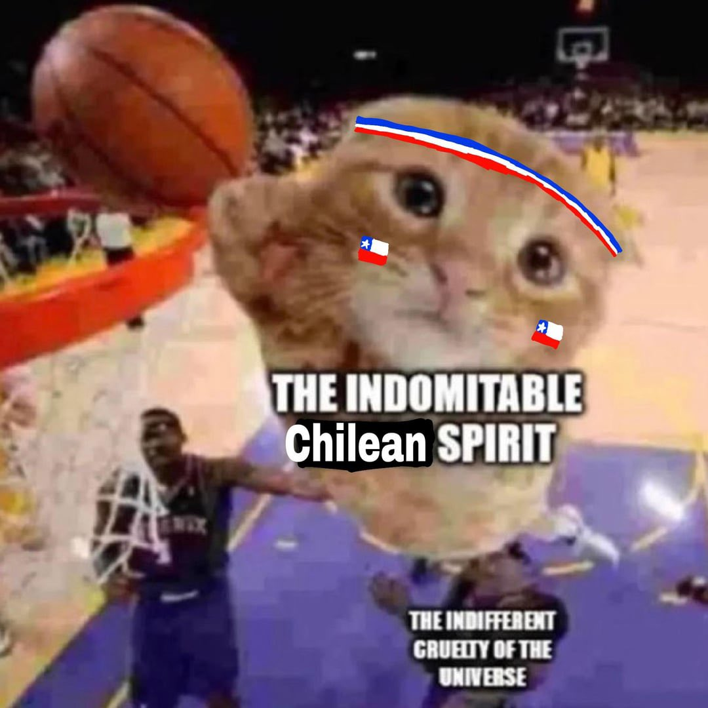

## About me

  

Hello there, I'm Javier. Just a chilean guy 🇨🇱, my degree say that im a software engineer but 
I also like to study spin system.

Most of the time, my codes are in python, js/ts, julia, rust and go.

Currently:
1. Working at the chilean antarctic institute.
2. Studying a glaciology master degree in the university of Magallanes.
3. Working as a web cordination at IGSEGG.

You can contact me sending an email to javier.norambuenal(*)sansano.usm.cl (replace * by @).
